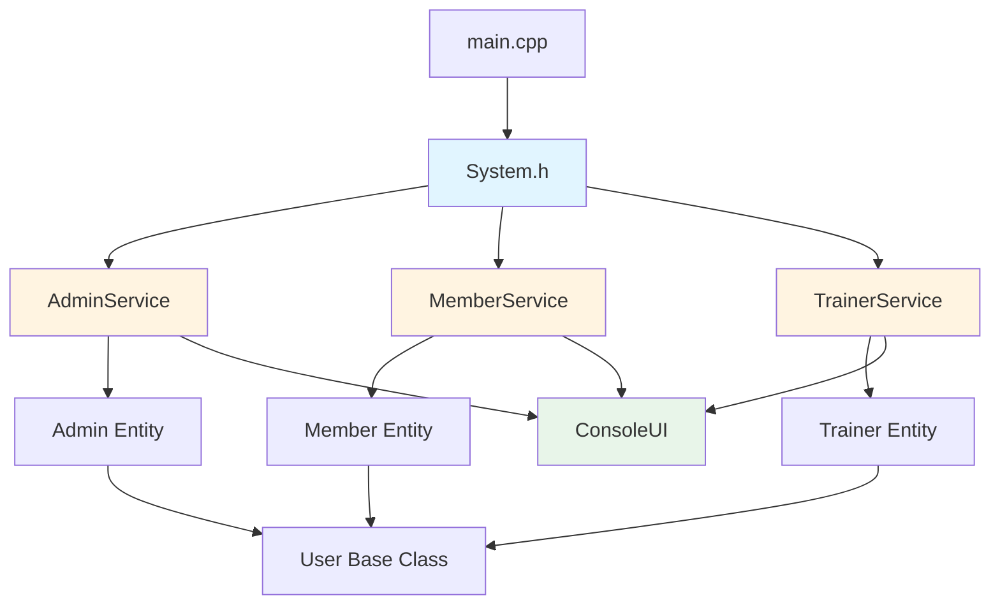
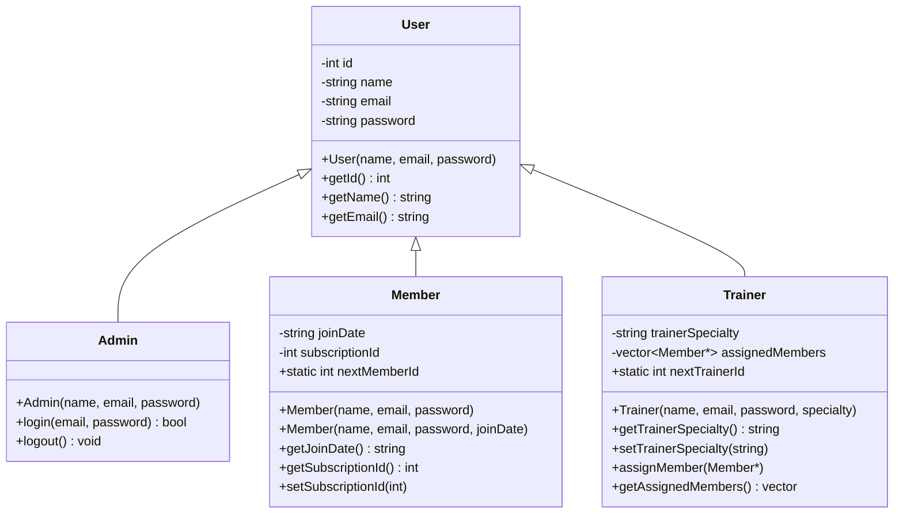
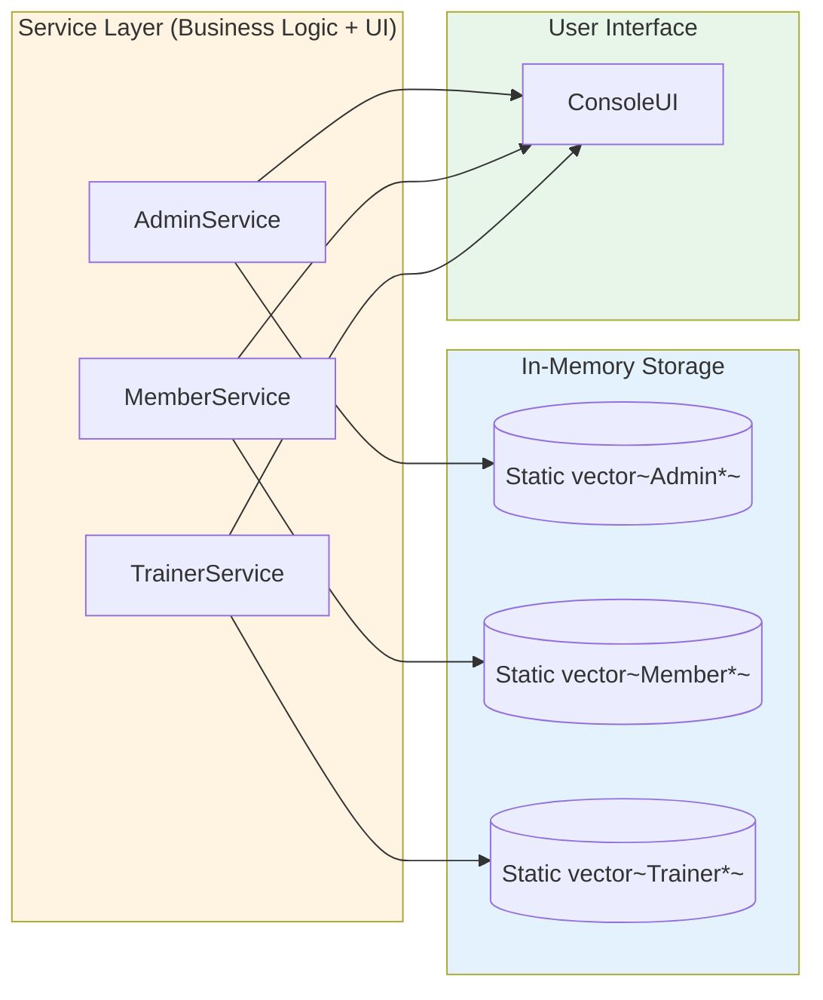
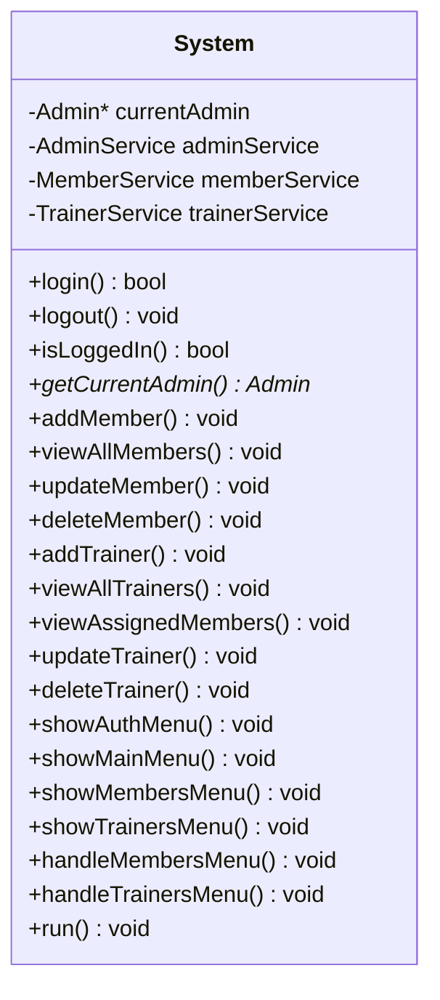
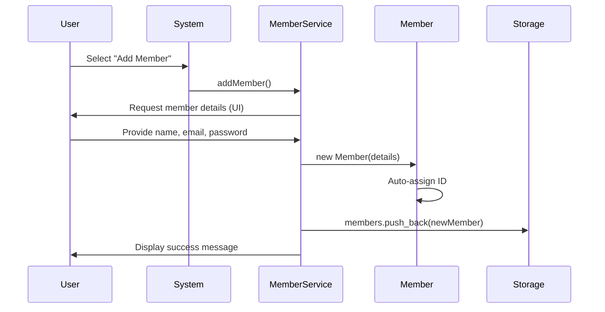
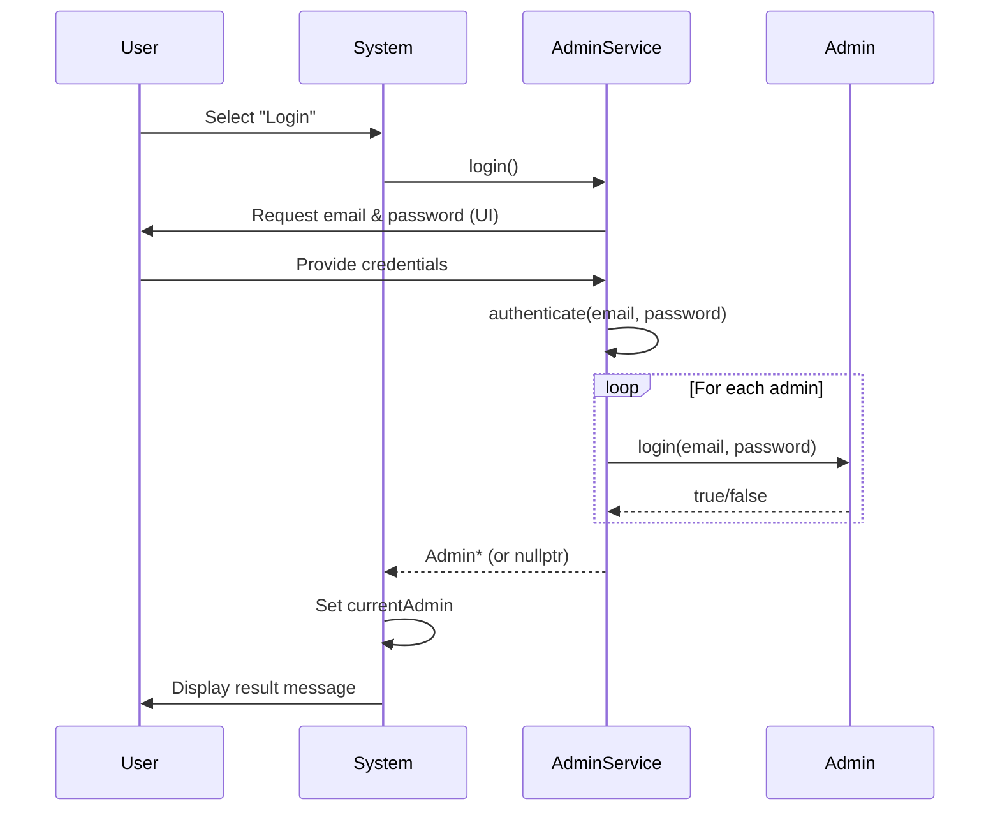

# El-Forma Gym Management System - Architecture Documentation

## Project Overview

El-Forma is a gym management system built in C++ that manages members, trainers, and administrators with an in-memory data storage system.

---

## Use Cases

### Main Usecase


### Refactor Usecase


## Activity Diagrams

<table>
    <tr>
      <td>
        <h4>Add Member</h4>
        
      </td>
      <td>
        <h4>Update Member</h4>
        
      </td>
      <td>
        <h4>Assign Member to Trainer</h4>
        
      </td>
    </tr>
  </table>


---

## Project Structure

```
El-Forma/
├── src/
│   ├── main.cpp                    # Entry point
│   ├── entities/                   # Domain entities
│   │   ├── User.h                  # Base user class
│   │   ├── Admin.h                 # Administrator entity
│   │   ├── Member.h                # Member entity
│   │   ├── Trainer.h               # Trainer entity
│   │   └── System.h                # Main system controller
│   ├── services/                   # Service layer (Business logic + UI)
│   │   ├── ConsoleUI.h             # Console UI utilities
│   │   ├── AdminService.h          # Admin operations & UI
│   │   ├── MemberService.h         # Member operations & UI
│   │   └── TrainerService.h        # Trainer operations & UI
│   └── output/                     # Compiled executables
```

---

## Architecture Overview



---

## Class Hierarchy

### Entity Inheritance



---

## Service Layer Architecture



---

## Service Classes Details

### AdminService

**Responsibilities:**
- Admin authentication (login/logout)
- Admin management
- UI for admin operations

**Key Methods:**
- `login()` - Handles admin login with UI
- `logout(Admin*)` - Handles admin logout with UI
- `authenticate(email, password)` - Validates credentials
- `findAdminByEmail(email)` - Finds admin by email
- `addAdmin(Admin*)` - Adds new admin

**Data:**
- Static `vector<Admin*> admins` - In-memory admin storage
- Default admin: admin / 123

---

### MemberService

**Responsibilities:**
- Member CRUD operations
- UI for member management
- Member data storage

**Key Methods:**
- `addMember()` - Add new member with UI
- `viewAllMembers()` - Display all members in table
- `updateMember()` - Update member subscription
- `deleteMember()` - Delete member with confirmation
- `findMemberById(id)` - Find member by ID
- `getAllMembers()` - Get all members (for trainer assignment)
- `isEmpty()` - Check if members exist

**Data:**
- Static `vector<Member*> members` - In-memory member storage
- Test data: Mohamed, Ahmed, Mostafa

---

### TrainerService

**Responsibilities:**
- Trainer CRUD operations
- UI for trainer management
- Member assignment to trainers
- Trainer data storage

**Key Methods:**
- `addTrainer()` - Add new trainer with UI
- `viewAllTrainers()` - Display all trainers in table
- `viewAssignedMembers()` - Show members assigned to a trainer
- `updateTrainer(availableMembers)` - Update trainer or assign members
- `deleteTrainer()` - Delete trainer with confirmation
- `findTrainerById(id)` - Find trainer by ID
- `isEmpty()` - Check if trainers exist

**Data:**
- Static `vector<Trainer*> trainers` - In-memory trainer storage
- Test data: Amir (Cardio), Kareem (Strength), Maged (Yoga)

---

## System Class (Main Controller)



**Responsibilities:**
- Application entry point
- Menu navigation
- Session management (current admin)
- Delegates all operations to services

---

## Data Flow

### Member Creation Flow



### Login Flow



---

## Key Design Patterns

### 1. **Service Layer Pattern**
- Services encapsulate business logic and UI
- Clear separation: System (controller) → Services (logic + UI) → Entities (data)

### 2. **Static Storage (Singleton-like)**
- Each service maintains static storage for its entities
- Shared across all service instances
- Data persists during application session

### 3. **Inheritance Hierarchy**
- `User` base class for common user functionality
- `Admin`, `Member`, `Trainer` extend with specific features

### 4. **Delegation Pattern**
- `System` delegates all operations to appropriate services
- No business logic in System class

---

## Memory Management

### Storage Lifecycle

- **Initialization**: Services create test data on first access
- **Runtime**: Entities dynamically allocated with `new`
- **Session**: Data persists in static vectors
- **Cleanup**: Manual deletion when removing entities
- **Restart**: All data lost (in-memory only)

### Important Notes

⚠️ **No Persistence**: Data is lost when application closes  
✅ **Default Admin**: Always available (mohamed@gmail.com / admin)  
✅ **Auto-increment IDs**: Each entity type manages its own ID counter  

---

## Test Data

### Default Admin
| Name           | Email             | Password |
| -------------- | ----------------- | -------- |
| Mohamed Rashad | mohamed@gmail.com | admin    |

### Default Members
| ID  | Name    | Email             | Password | Join Date  | Subscription |
| --- | ------- | ----------------- | -------- | ---------- | ------------ |
| 1   | Mohamed | mohamed@gmail.com | 123      | 2024-01-15 | 1            |
| 2   | Ahmed   | ahmed@gmail.com   | 123      | 2024-02-20 | 2            |
| 3   | Mostafa | mostafa@gmail.com | 123      | 2024-03-10 | 0            |

### Default Trainers
| ID  | Name   | Email            | Password   | Specialty         |
| --- | ------ | ---------------- | ---------- | ----------------- |
| 1   | Amir   | amir@gmail.com   | trainer123 | Cardio            |
| 2   | Kareem | kareem@gmail.com | trainer456 | Strength Training |
| 3   | Maged  | maged@gmail.com  | trainer789 | Yoga              |

---

## Compilation & Execution

```bash
# Compile
g++ -Wall -Wextra -g3 src/main.cpp -o src/output/main.exe

# Run
cd src/output
./main.exe
```

**Compiler Warnings:** 
- Inline static variables require C++17 (`-std=c++17`)

---
